# PtyReel

[](https://github.com/Paxton-Meny/PtyReel/actions/workflows/ci.yml)
[](https://github.com/Paxton-Meny/PtyReel/actions/workflows/action.yml)
[](https://github.com/Paxton-Meny/PtyReel/security/code-scanning)
[](https://github.com/Paxton-Meny/PtyReel/releases)
[](https://github.com/Paxton-Meny/PtyReel/blob/main/pyproject.toml)
[](LICENSE)

Record scripted terminal sessions as self-contained animated SVGs, using only
the Python standard library.

You write a `.tape` file describing a session (type this, wait, press that).
PtyReel plays it inside a real pseudo-terminal, captures the output with its
timing and colors, and renders an animated SVG you can drop straight into a
README or docs site. No browser, no GIF encoder, no dependencies: a consumer
adds the action or runs the module, and gets living documentation of their
actual CLI.



That image is the output of [demos/hello.tape](demos/hello.tape). It animates
with CSS alone, so it plays inside a README where scripts never run.

## Status

Early development, released as `v0.1.0`. The tape format and the rendered
output may change in any 0.x release, so pin a full version if that matters to
you and read the changelog before upgrading.

## Requirements

Python 3.11 or newer on a POSIX system. Linux, macOS, or WSL. There is nothing
to install: the runtime, the tests and the quality gate use only the standard
library. Windows is a development platform only, because `pty` does not exist
there.

## Use it as an action

```yaml
- uses: actions/checkout@v4
- uses: Paxton-Meny/PtyReel@v0
  with:
    tape: demos/hello.tape
```

| Input | Default | What it does |
| --- | --- | --- |
| `tape` | required | Path to the `.tape` file, relative to the workspace. |
| `output` | tape's own path | Where to write the SVG, relative to the workspace. |
| `check` | `false` | Validate the tape and stop. Nothing runs, nothing is written. |
| `workspace` | the checkout | Directory every path must stay inside. |

| Output | What it holds |
| --- | --- |
| `svg-path` | Workspace-relative path of the rendered SVG. Empty when `check` is true. |

Rendering runs the commands in the tape, so treat a tape with the same care as
a workflow file. Validating every tape on a pull request costs a second and
needs no terminal:

```yaml
- uses: Paxton-Meny/PtyReel@v0
  with:
    tape: demos/hello.tape
    check: true
```

## Use it from a shell

```bash
python -m ptyreel demos/hello.tape
```

```
usage: ptyreel [-h] [--workspace DIR] [--output PATH] [--check] [--version]
               TAPE [TAPE ...]
```

Each rendered path is printed on standard output. Errors go to standard error
and name the file and the line:

```
ptyreel: demos/hello.tape:7: Sleep needs a duration such as 250ms or 2s, got '500'
```

Exit codes are 0 for success, 1 for a reported error, 2 for a usage mistake,
and 130 for an interrupt.

## Tape syntax

One directive per line. Blank lines are ignored. `#` starts a comment unless it
sits inside a quoted string. `Output`, `Require` and `Set` must all come before
the first action, which is what lets a tape be checked completely before
anything runs.

### Configuration

| Directive | Argument | Default | Meaning |
| --- | --- | --- | --- |
| `Output` | relative `.svg` path | required | Where the image is written. |
| `Require` | command name | none | Fail early if this is not on the path. Repeatable. |
| `Set Shell` | `"bash"` | `bash` | Shell to run. |
| `Set FontSize` | 8 to 40 | `15` | Text size in pixels. Drives every other measurement. |
| `Set Width` | 320 to 4096 | `900` | Image width in pixels. |
| `Set Height` | 200 to 4096 | `550` | Image height in pixels. |
| `Set Padding` | 0 to 64 | `24` | Gap between the window edge and the text. |
| `Set TypingSpeed` | 1ms to 2s | `55ms` | Delay between typed characters. |
| `Set Theme` | `"github-dark"`, `"github-light"` | `github-dark` | Palette. |
| `Set Title` | quoted text | `"bash"` | Title bar text. |
| `Set Loop` | `true`, `false` | `true` | Whether the animation replays for ever. |
| `Set LoopDelay` | 0 to 30s | `2500ms` | How long the finished session rests before a replay. |
| `Set MaskSecrets` | `true`, `false` | `true` | Redact values of secret-looking environment variables. |
| `Set Anonymize` | `true`, `false` | `true` | Record as a generic machine rather than as yours. |

### Actions

| Directive | Argument | Meaning |
| --- | --- | --- |
| `Type` | quoted text | Send characters one at a time, as a person typing. |
| `Enter` `Tab` `Space` `Backspace` `Escape` | none | Send that key. |
| `Up` `Down` `Left` `Right` `Home` `End` | none | Send that key. |
| `PageUp` `PageDown` `Delete` | none | Send that key. |
| `Ctrl+<letter>` | none | Send a control character, such as `Ctrl+C`. |
| `Sleep` | 1ms to 30s | Hold still and keep reading output. |
| `Hide` / `Show` | none | Stop and resume recording without stopping the session. |

Durations always carry a unit, `ms` or `s`. Inside `Type`, the escapes `\"`,
`\\`, `\n` and `\t` resolve; anything else after a backslash is an error.

`Hide` is for setup a reader does not need to watch:

```
Hide
Type "cd example && export PAGER=cat"
Enter
Sleep 300ms
Show
```

### Limits

A tape is refused if it exceeds any of these, and the message names the line.

| Limit | Value |
| --- | --- |
| Tape file | 64 KiB |
| Instructions | 500 |
| Characters per `Type` | 1000 |
| Declared timing, typing and sleeping added up | 120 s |
| Output read from the terminal | 8 MiB |
| Rendered image | 4 MiB |

## How it works

```
tape text  ->  parse and validate      no terminal is opened until this passes
           ->  play in a pty           a real shell, a real terminal size
           ->  screen model            text, colour, cursor, scrolling
           ->  render                  one CSS animated SVG
           ->  write                   atomically, inside the workspace
```

The timeline comes from the tape, not from the clock. A tape declares how fast
it types and how long it waits, so the same tape run twice against the same
program produces the same bytes. A rendered demo is therefore something a
repository can hold and check rather than something that churns on every run.

Real time still passes and still bounds the session. It simply never reaches
the recording.

### What the screen model handles

Text, tabs, backspace, carriage return and newline. Cursor movement, erasing a
line or the screen, and colour and text attributes. Scrolling moves the window
rather than losing text, and a line that gets rewritten is replaced rather than
drawn over, so progress bars and prompt redraws come out right.

Not supported, and consumed without corrupting the text around it: the
alternate screen buffer, background colours, and the 256 colour and true colour
forms of `SGR 38` and `SGR 48`. Full screen programs are out of scope.

## Security

A tape runs shell commands by design, so it carries the same trust as the
workflow that renders it. Three things follow from that, and all three are
enforced rather than advised.

The shell gets a short allowlist of environment variables. A workflow token is
not present inside a session at all, which is what keeps it out of a committed
image. Redaction is a second line, not the first.

Output paths are validated as strings, then walked one directory at a time
through open descriptors that refuse to follow a symbolic link. Nothing is
written outside the workspace, and nothing dotted, so `.git` is unreachable.

Every character that reaches the document is filtered and escaped. XML has no
representation for most control characters, so they are removed rather than
escaped. The output holds no script, no external reference and no font.

### Recording as a generic machine

A rendered image is made to be published, so by default the session is recorded
as somebody generic. `$USER`, `$HOME` and `~` read as `LocalUser` and
`/home/LocalUser`, and the answers `whoami`, `id` and `hostname` give are
substituted on the way out, because those ask the kernel and no environment
variable can change them. The session also runs with a fresh home directory of
its own, so a tape cannot leave anything behind in your real one.

The working directory is not rewritten. A demo usually runs inside the project
it is demonstrating and that path is meant to be seen, though a project living
under your home has the home part replaced like any other path. Turn the whole
thing off with `Set Anonymize false` when you want the real machine on screen.

See [SECURITY.md](SECURITY.md) to report a problem.

## Repository layout

```
action.yml          the GitHub Action interface
src/ptyreel/        tape parsing, terminal model, pty driver, renderer
tests/              unittest suite mirroring src/
demos/              .tape sources and their rendered output
hooks/              plain git hooks that run the quality gate
```

## Contributing

This is a personal project and **pull requests are not accepted**, including
small ones. Issues are welcome and are the supported way to report a bug or
suggest a feature. Please do not spend your time on a change that will be
closed unmerged.

There is nothing to install. One command is the whole gate:

```bash
python -m compileall -q src tests && python -m unittest discover -s tests
```

See [CONTRIBUTING.md](CONTRIBUTING.md) for the rest.

## License

Apache-2.0.
